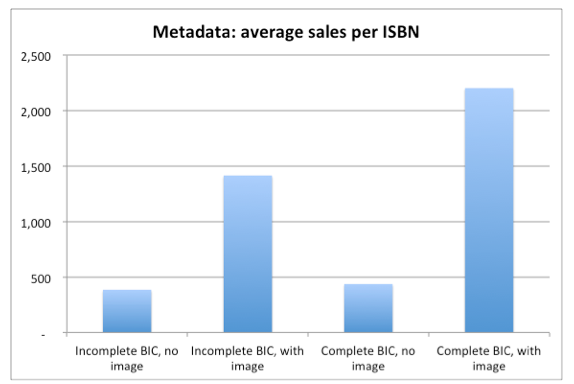

## ¿Marketing de libros?

Cada día en algún artículo en prensa o en algún post en la web algún editor se queja de que en España se editan y publican demasiados libros. Naturalmente, si uno es editor, esta no es una razón para dejar de publicar libros (el editor cree que su libro es necesario, de alguna manera, y que va a enriquecer la vida de sus posibles lectores, de lo contrario no emprendería la penosa y a menudo onerosa tarea de editarlo e imprimirlo)), aunque si lo es para preguntarse cómo podemos hacer que nuestro libro *exista* para sus lectores lectores. Lo que nos lleva a la cuestión del marketing: ¿Qué significa una buena campaña de marketing para un libro? ¿Qué necesitamos hacer o saber para impulsar el descubrimiento de nuestro libro por sus potenciales lectores?

Sabemos también que un libro, en la medida en que es un objeto puesto a la venta, puede tener y necesita una estrategia para convencer a su mercado objetivo que el dinero invertido en el es dinero bien gastado. Aquí las cosas se vuelven un poco más complicadas. La necesidad de un libro en concreto no es algo objetivo y por tanto no se puede medir con las herramientas habituales para realizar este tipo de estadística. La gente compra libros por un número de razones, y ninguna de ellas tiene que ver con una necesidad. También es cierto que muchos, la vasta mayoría, en efecto, de objetos que se ponen a la venta no satisfacen necesidades primarias. Un coche deportivo no es *necesario* para la vida de nadie y, ni siquiera, es algo que uno adquiere por comodidad: se trata aquí de estatus, del hecho de ese objeto adquiere un valor de uso, pero también como algo que se exibe.

## ¿Cómo se decide la compra de un libro?

La respuesta a esta pregunta es sencilla: el boca a oreja. O, en términos más formales, por medio de una recomendación fiable. Este concepto (una recomendación fiable) es altamente dificil de caracterizar. Tradicionalmente, esto correspondía al círculo de conocidos o, en una escala más general, a los canales de recomendación populares (grandes cabeceras, revistas literarias, pasando por la palabra de nuestro librero de confianza. Pero junto con la democratización de la web, la colonización de las cabeceras por los grandes grupos editoriales, y la reformulación del papel del librero tradicional, los canales de recomendación se han redefinido y ahora forman una red muchísimo más compleja, que incluye blogs, redes sociales, plataformas de venta (las reseñas en Amazon o Goodreads constituyen en algunos casos razones suficientes para decidir la adquición de un libro), newsletters, y prensa digital independiente. Lo cierto es que esta diversificación comporta la necesidad de una estrategia nueva. Nadie puede estar en tantos sitios a la vez.

## El mercado del libro y el marketing: la visibilidad

De lo se trata, en último término, de que los libros sean visibles y es tarea del editor construir el contexto donde sus libros pueden ser descubiertos.
Pero, ¿como se hace esto?

El año 2015, sólo en España, se publicaron 79.397 libros, de los cuales 77.453 eran primeras ediciones. En esta ingente cantidad de material impreso, es naturalmente muy fácil que un libro pase desapercibido: los canales de promoción tradicional no dan abasto y, en general, como hemos mencionado, son ocupados (o monopolizados, esto último es en realidad más exacto) por las grandes editoriales. Dicho esto, que es una situación real, también hay que agregar que estos canales no sólo son insuficientes, sino que, además, *no son en absoluto relevantes*. Por que la auténtica revolución digital no concierne a si leo en papel o no, o si compro en una tienda virtual o en el quisco de la esquina de casa. Lo que define auténticamente la modificación radical del modelo es no cómo compramos, sino cómo se encuentra, gestiona, almacena, produce y propága la información acerca de lo que consumimos y cómo lo consumimos. Estamos hablando de Data. Y para comprender cómo funciona el marketing (de cualquier producto, pero en especial de un libro), necesitamos enfocarnos en el comportamiento de los datos.

Tenemos dos tipos de información asociada a los libros, la información estructurada y la desestructurada. La estructura es una cuestión de parámetros y de estandares, del vehículo que utilicemos para propagar dicha información.

Ejemplos de data estructurada son [schema.org], que proporciona un repertorio de etiquetas para clasificar información relativas a las páginas web, o [DCMD], que es una de las organizaciones que mantienen estandares (incorporado, en este caso, a la última revisión de la especificación EPUB3 para libros electrónicos) para describir objetos digitales, o El Dewey, que es un sistema estandar de clasificación de documentos en bibliotecas. Hay muchísimos más (ver en el apendice), de momento, lo que importa retener es lo siguiente: esta *data* o información, en el formato que sea (microdata, microformatos, metadata), está estructurada utilizando etiquetas o códigos (o ambas cosas) estandarizados a su vez en una especificación, y en general se describen utilizando JSON o XML como lenguaje para garantizar su transmisión electrónica entre motores de búsqueda y bases de datos.

El segundo tipo de data (información) es desestructurada (en el sentido de que no existe un lengujae de etiquetado o una especificación que limite su repertorio simbólico) y podemos describirla como el resultado del procesamiento del lenguaje natural o como fruto del análisis semántico.

## Google Hummingbird

Google introdujo su nuevo algoritmo de busqueda, *Hummingbird*,en 2013. El centro de su rediseño (o reconstrucción, más exactamente) estuvo presidido por la necesidad de enfocarse en equivalencias y relaciones entre términos de busqueda más que en los términos de búsqueda en si mismos. Lo que importa en este caso es el patrón (frase, pregunta, indicación) que relaciona los términos de la búsqueda ([éste](https://moz.com/blog/hummingbird-unleashed) estupendo artículo lo explica inmejorablemente). Explicar de qué manera hace esto, excede los límites de este documento. Lo que es importante es que el algoritmo de busqueda ha experimentado una reorientación radical hacia el lenguaje natural. Y de esta manera han cambiado también los parámetros por los cuales un objeto (del tipo que sea) se vuelve visible para alguien que lo busca. Se trata de como buscar en la red y de cómo encontrar. Después de todo, estamos hablando de Google.

## ¿Marketing de libros?

Esto es relevante por que las grandes plataformas que sostienen el mercado del libro (digamos Amazon, pero tambien Barnes & Noble, Kobo, etc...) se hicieron un lugar en este mercado no por que supieran mucho de libros ni de lectores, si no por que entendieron cómo se iba a gestionar la información sobre estos libros y estos lectores mientras la revolución digital tenía lugar. Amazon, por usar sólo un ejemplo, no es una tienda (o no es principalmente una tienda): es esencialmente un buscador.

## Metadatos, una historia

Durante la Edad Media, antes de invención de la imprenta por parte de Gutemberg, los productores y coleccionistas de manuscritos ya mantenían catálogos que detallaban sus tesoros. Más tarde, cuando el libro impreso se hizo norma, los vendedores a su vez ampliaron esos catálogos para a su vez ingresar los datos relativos a los compradores, los encargos y el precio. La Feria de Frankfurt emrgió en este contexto, como un mercado de  compra venta de libros e intercambio de información. El desarrollo del mercado condujo a la creación de gremios de impresores y libreros y a la creación de los primeros estandares (la página de título en un libro, por ejemplo, o la nota de impresión). Aquí es cuando, en rigor, comienza la historia de los metadatos, aunque hubo  que esperar hasta el Siglo Veinte a que se acuñara el término (Bagley, 1968).

Los metadatos han sido estandarizados, codificados e indexados por los profesionales de la información durante al menos los últimos cien años; Mientras que este proceso se ha acelerado en la era digital, los metadatos ya no son la única fuente de información que los editores y bibliotecarios poseen (Gilliland 2008, 1). Los metadatos creados por el usuario han explotado a través de marcadores sociales, reseñas en Amazon y Goodreads, y en etiquetas en LibraryThing, entre otros.

Todo esto nos lleva de vuelta al algoritmo de Google: la compleja red de información que describe los millones de documentos archivados (libros, pero también revistas, catálogos, grabaciones de audio, registros de entrevistas, etc...) y el mismo flujo de esta información, exigen tecnologías complejas de transmisión. XML, JSON, son ahora palabras de uso común en ciertos sectores editoriales y describen esquemas de trasnsmisión y compartición de datos. Pero, como ya hemos mencionado, tal vez sea mucho pedir que los reseñistas que acuden a Goodreads para reseñar un libro o el pequeño editor que edita un puñado de títulos al año empleen (o siquiera entiendan) esas tecnologías. De manera que han proliferado una serie de sistemas de catalogación (por que eso es lo que son) de la información que se comparte día tras día en redes sociales que dependen mucho más del lenguaje natural y se estructuran de una manera muchísimo más libre. Hablamos de los *Hashtags* de Twitter, de las categorías que nos permiten movernos con cierta comodidad en un blog, de las etiquetas que hacen navegable un documento extenso.

## pero los metadatos si son fundamentales

Naturalmente podríamos preguntarnos si un editor debería tomarse tantas molestias, aunque sospechemos que de alguna manera los metadatos ayudan a las ventas de un libro. Sin embargo, el impacto de la correcta asignación de metadatos en los libros editados ha sido cuantificado. Un estudio de Nielsen Book, muestra el dramático efecto que tiene sobre las ventas de libros el hecho de que estos sean lanzados con un conjunto correcto de matadatos asociados.

## estrategias

Hasta ahora se han descrito muy someramente las razones de por qué los metadatos son la base de cualquier estrategia de marketing en entornos digitales. Ahora vamos a examinar algunas estrategias puntuales para incorporar los metadatos en nuestro workflow y hacerlos trabajar a nuestro favor.

##
### El ISBN

Cualquier editor está obligado a obtener un [ISBN] cuando decide lanzar un nuevo título al mercado. En España, el ISBN está gestionado por la agencia del ISBN que, a su vez, depende de la Federación de Gremios de Editores de España. para dar de alta un libro en esta plataforma, se han de proporcionar ciertos datos, son los metadatos centrales de un libro. Pero además, es posible añadir una serie de campos de metadatos (los "metadatos ricos") que incluyen

De manera que hay que atender, en primer lugar, a cómo círcula la información sobre estos libros. Lo que equivale a decir que necesitamos entender como funcionan los metadatos.

Los metadatos de un libro lo constituyen toda la información que utilizamos para describirlo: esto incluye la sinopsis (de la misma manera que el texto de contraportada sirve en las librerías para informarnos sobre el contenido de determinado título), su precio, las reseñas que ha recibido, la biografía del autor y los premios que su obra pueda haber merecido. Pero también otra información, algo menos obvia. Para navegar en esta selva de material impreso, se han ideado y perfeccionado a lo largo de los años, numerosos (y cada vez más sofisticados) sistemas de categorización y clasificación. No basta con decir que un libro es una novela o que la novela es de tema policial: existe una vasta nomenclatura de subcategorías que pueden precisar una busqueda desde el rango de cientos de miles de ocurrencias ("novela policial") a apenas unos cientos o unas decenas (novela *negra* policial, en lengua gallega, ambientada a fines del siglo XX, con elementos eróticos y en una localización mediterranea[^1].

----

[^1]: Algunos de estos sistemas de clasificación son estandares y sirven a determinado mercado: entre los más conocidos tenemos el IBIC (International Book Industry Categories,  desarrollado por [BIC] (http://www.bic.org.uk) de uso principalmente en Europa y con una clara orientación comercial, el BISAC (Book Industry Standards and Communications, desarrolado por [BISG](http://bisg.org/page/bisacedition) y de uso en los Estados Unidos, Canada, Australia y Nueva Zelanda), el Dublin Core (modelo de metadatos elaborado y auspiciado por la [DCMI](http://www.dublincore.org) y parte de la especificación EPUB), ONIX for Books (estándar internacional diseñado para la codificación y el intercambio electrónico de información bibliográfica y comercial orientada a la industria del libro y mantenido por [EDItEUR](http://www.editeur.org/) y que es el modelo por el que ha optado DILVE. Pero, además, tenemos otros repertorios de metadatos, igualmente estandares, y que sirven a funciones más específicas o están aún en desarrollo.

Author, title, ISBN, publisher, genre, language, original title, translator, media review, date published, subject, keywords, book length, number of words, chapter length, time period, readability rating, pace, key attributes, content rating, dialogue, word types, distinct word prevalence, mood, sentiment, entities, specific references, places, people, action, character ages, expected same readers as specific books.

[1]: http://www.abc.es/cultura/libros/abci-2016-publicaron-81391-libros-espana-201702011252_noticia.html

ISBN: International Standard Book Number
